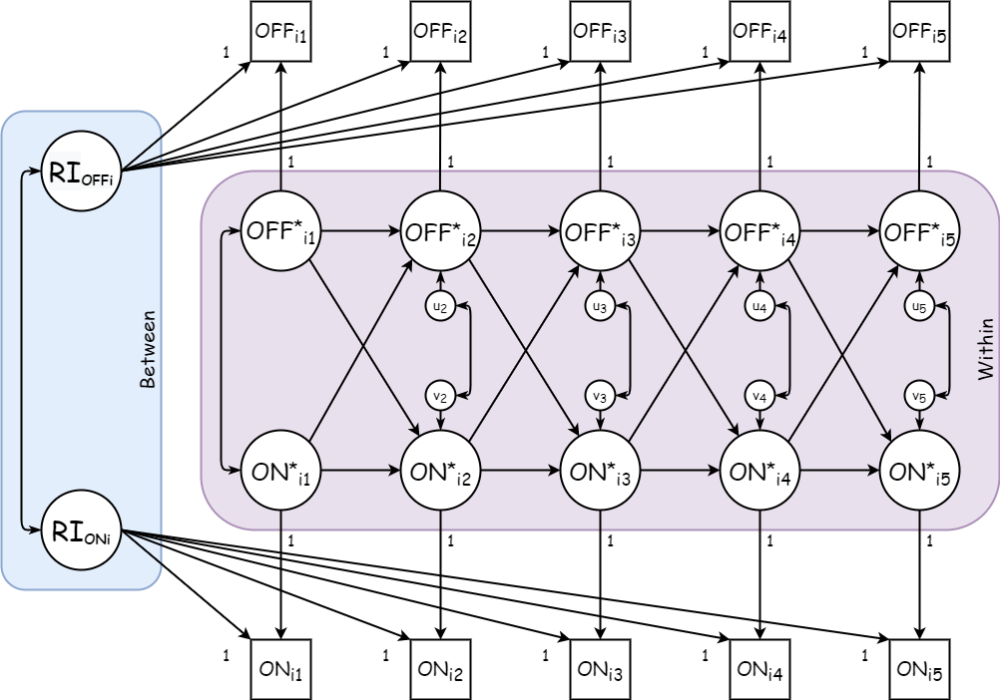

# Modelo {#modelo}

Con datos de ELSOC, replicaremos los resultados de Chayinska, Miranda & Gonzalez (2021)

Analizaremos las relaciones longitudinales entre la participación política online y off-line a través de la estimación de RI-CLPM.

Las medidas que utilizaremos son las siguientes:

- Participacion politica on-line fue medida con un ítem unico en el cual se pregunta a los participantes reportar la frecuencias con la cual usan las redes sociales para expresar su opinión acerca de temas publicos durante los ultimos 12 meses (de 1 = nunca a 5 = muy frecuentemente).

- Participacion off-line en acciones colectivas fue medida con un item unico en el cual se pregunta a los participantes reportar que tan frecuentemente asistieron a una marcha o manifestacon politica durante los ultimos 12 meses (de 1 = nunca a 5 = muy frecuentemente).

La figura 1 representa el modelo que pondremos a prueba.

```{r modelo, echo=FALSE, fig.align='center', fig.asp=.75, fig.cap='RI-CLPM conceptual de las asociaciones entre Participación Offline y Participación On-line', out.width='80%'}

```

$OFF_{it}$ y $ON_{it}$ son los **puntajes observados** de los participantes en participación off-line y participacion on-line respectivamente, en cada una de las 5 olas de ELSOC, para la persona $i$.

$RI_{OFFi}$ y $RI_{ONi}$ son los respectivos **interceptos aleatorios**, las desviaciones del individuo $i$, en terminos de su puntaje esperado, respecto a la gran media de cada variable. Se trata de aquellos factores individuales que no varian en el tiempo y representan el componente _between_.

$OFF^{*}_{it}$ y $ON^{*}_{it}$ representan las desviaciones temporales en $t$ del individuo $i$ respecto a sus puntajes esperados. Constituyen las **fluctuaciones intra-persona**, el componente _within_.

Los estados iniciales en $t = 1$ (aqui $OFF^{*}_{i1}$ y $ON^{*}_{i1}$) son modelados como variables exógenas (sus varianzas y covarianzas son asumidas). Se tiene el supuesto de que los componentes _within_ están correlacionados entre si en cada $t$. 

$u_{it}$ y $v_{it}$ son los residuos. Por lo general, se tiene por supuesto que los residuos $u_{it}$ y $v_{it}$ están normalmente distribuidos y correlacionados entre sí, dentro de cada tiempo $t \geq 2$.


