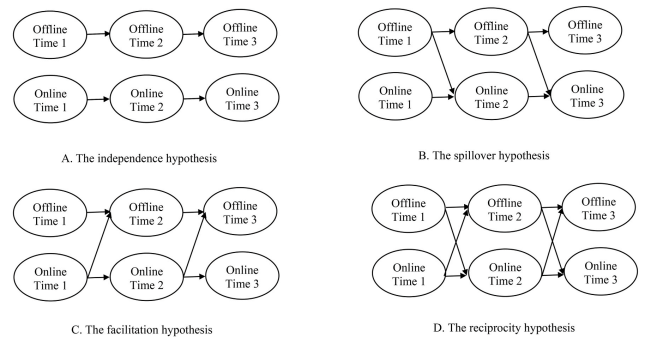

# Modelos anidados {#nestedm}

```{r include=FALSE}
library(dplyr)
library(tidyr)
library(data.table)
library(skimr)
library(MplusAutomation)
library(lavaan)
library(semoutput)
library(kableExtra)
library(texreg)


# Datos
load("data/elsoc_onoffline.Rdata")
```

La estimacion usualmente sigue una estrategia de modelos anidados entre los cuales se compara su bondad de ajuste.

Recordemos nuestras hipotesis

```{r nice-fig, echo=FALSE, fig.align='center', fig.asp=.75, fig.cap='Hipotesis en torno a las relaciones entre Participación Offline y Participación On-line', out.width='80%'}

```

De esta manera estimamos:

1. El modelo A contiene sólo los paths autorregresivos.
2. El modelo B unidireccional. Contiene los paths autorregresivos y los paths cross-lagged (forward).
3. El modelo C unidireccional. Contiene los paths autorregresivos y los paths cross-lagged (reverse).
4. El modelo D bidireccional. Contiene los paths autorregresivos y los paths cross-lagged en ambas direcciones.

Adicionalmente, en cada uno de estos modelos, se comparan las bondades de ajuste entre modelos estimados libremente y modelos constreñidos para testear si los efectos son iguales en el tiempo.


### Sintaxis constraints
En Mplus, las restricciones al modelo se realizan asignando etiquetas a los parametros y utilizando la misma etiqueta para los parametros que quedaran constreñidos a ser iguales.

Mplus:
```
    ! Estimar los efectos lagged (constreñidos en el tiempo)
      cx2 ON cx1 cy1 (a d); 
      cx3 ON cx2 cy2 (a d); 
      cx4 ON cx3 cy3 (a d); 
      cx5 ON cx4 cy4 (a d);
      cy2 ON cx1 cy1 (c b); 
      cy3 ON cx2 cy2 (c b); 
      cy4 ON cx3 cy3 (c b); 
      cy5 ON cx4 cy4 (c b);
```

En lavaan, las restricciones al modelo se logran a traves de pre-multiplicacion: Se agrega a cada parametro un numero al cual queremos fijarlo o una etiqueta, junto a un asterisco, y luego se indica el parametro en la especificacion del modelo. Para constreñir la igualdad entre parametros se utiliza frente a ellos el mismo numero o la misma etiqueta.

Lavaan:
```
    # Estimar los efectos lagged (constreñidos en el tiempo)
    cx2 ~ a*cx1 + d*cy1
    cx3 ~ a*cx2 + d*cy2
    cx4 ~ a*cx3 + d*cy3
    cx5 ~ a*cx4 + d*cy4
    cy2 ~ c*cx1 + b*cy1
    cy3 ~ c*cx2 + b*cy2
    cy4 ~ c*cx3 + b*cy3
    cy5 ~ c*cx4 + b*cy4
```

Estimamos los modelos:

<button class="tablinks" onclick="unrolltab(event, 'A1')">Modelo A1</button>
<button class="tablinks" onclick="unrolltab(event, 'A2')">Modelo A2</button>
<button class="tablinks" onclick="unrolltab(event, 'B1')">Modelo B1</button>
<button class="tablinks" onclick="unrolltab(event, 'B2')">Modelo B2</button>
<button class="tablinks" onclick="unrolltab(event, 'C1')">Modelo C1</button>
<button class="tablinks" onclick="unrolltab(event, 'C2')">Modelo C2</button>
<button class="tablinks" onclick="unrolltab(event, 'D1')">Modelo D1</button>
<button class="tablinks" onclick="unrolltab(event, 'D2')">Modelo D2</button>
<button class="tablinks" onclick="unrolltab(event, 'Run')">Run</button>


::: {#A1 .tabcontent}

```{r}
modelos <- list()
modelos[["m_A1"]] <- mplusObject(
  TITLE = "RI CLPM - A1;",
  
  ANALYSIS=
    "ESTIMATOR = mlr;
    ITERATIONS = 5000;",
  
  MODEL = "
    ! Crear los componentes between
      RI_x BY marchw01@1 marchw02@1 marchw03@1 marchw04@1 marchw05@1;
      RI_y BY redesw01@1 redesw02@1 redesw03@1 redesw04@1 redesw05@1;
    
    ! Crear los componentes within
      cx1 BY marchw01@1; 
      cx2 BY marchw02@1; 
      cx3 BY marchw03@1;
      cx4 BY marchw04@1; 
      cx5 BY marchw05@1;
      
      cy1 BY redesw01@1;
      cy2 BY redesw02@1;
      cy3 BY redesw03@1;
      cy4 BY redesw04@1;
      cy5 BY redesw05@1;

    ! Constrenir las varianzas del error de medicion a cero
      marchw01 - redesw05@0;

    ! Estimar los efectos lagged (autorregresivos)
      cx2 ON cx1; 
      cx3 ON cx2; 
      cx4 ON cx3; 
      cx5 ON cx4;
      cy2 ON cy1; 
      cy3 ON cy2; 
      cy4 ON cy3; 
      cy5 ON cy4;
    
    ! Estimar la covarianza entre los componentes within t=1
      cx1 WITH cy1;
    
    ! Estimar las covarianzas entre los residuos del componente within (innovations)
      cx2 WITH cy2; 
      cx3 WITH cy3; 
      cx4 WITH cy4; 
      cx5 WITH cy5;
      
    ! Estimar la covarianza entre los RI
      RI_x WITH RI_y;      
      
    ! Fijar la correlacion entre los RI y componentes within t=1 a cero 
      RI_x WITH cx1@0 cy1@0;
      RI_y WITH cx1@0 cy1@0;
  "
,

  OUTPUT = "CINTERVAL sampstat mod stdyx tech1 tech4;",
  rdata = elsoc)
```

:::


::: {#A2 .tabcontent}

```{r}
modelos[["m_A2"]] <- mplusObject(
  TITLE = "RI CLPM - A2;",
  
  ANALYSIS=
    "ESTIMATOR = mlr;
    ITERATIONS = 5000;",
  
  MODEL = "
    ! Crear los componentes between
      RI_x BY marchw01@1 marchw02@1 marchw03@1 marchw04@1 marchw05@1;
      RI_y BY redesw01@1 redesw02@1 redesw03@1 redesw04@1 redesw05@1;
    
    ! Crear los componentes within
      cx1 BY marchw01@1; 
      cx2 BY marchw02@1; 
      cx3 BY marchw03@1;
      cx4 BY marchw04@1; 
      cx5 BY marchw05@1;
      
      cy1 BY redesw01@1;
      cy2 BY redesw02@1;
      cy3 BY redesw03@1;
      cy4 BY redesw04@1;
      cy5 BY redesw05@1;

    ! Constrenir las varianzas del error de medicion a cero
      marchw01 - redesw05@0;

    ! Estimar los efectos lagged (autorregresivos)
      cx2 ON cx1 (a); 
      cx3 ON cx2 (a); 
      cx4 ON cx3 (a); 
      cx5 ON cx4 (a);
      cy2 ON cy1 (b); 
      cy3 ON cy2 (b); 
      cy4 ON cy3 (b); 
      cy5 ON cy4 (b);
    
    ! Estimar la covarianza entre los componentes within t=1
      cx1 WITH cy1;
    
    ! Estimar las covarianzas entre los residuos del componente within (innovations)
      cx2 WITH cy2; 
      cx3 WITH cy3; 
      cx4 WITH cy4; 
      cx5 WITH cy5;
      
    ! Estimar la covarianza entre los RI
      RI_x WITH RI_y;      
      
    ! Fijar la correlacion entre los RI y componentes within t=1 a cero 
      RI_x WITH cx1@0 cy1@0;
      RI_y WITH cx1@0 cy1@0;
  "
,

  OUTPUT = "CINTERVAL sampstat mod stdyx tech1 tech4;",
  rdata = elsoc)
```

:::

::: {#B1 .tabcontent}

```{r}
modelos[["m_B1"]] <- mplusObject(
  TITLE = "RI CLPM - B1;",
  
  ANALYSIS=
    "ESTIMATOR = mlr;
    ITERATIONS = 5000;",
  
  MODEL = "
    ! Crear los componentes between
      RI_x BY marchw01@1 marchw02@1 marchw03@1 marchw04@1 marchw05@1;
      RI_y BY redesw01@1 redesw02@1 redesw03@1 redesw04@1 redesw05@1;
    
    ! Crear los componentes within
      cx1 BY marchw01@1; 
      cx2 BY marchw02@1; 
      cx3 BY marchw03@1;
      cx4 BY marchw04@1; 
      cx5 BY marchw05@1;
      
      cy1 BY redesw01@1;
      cy2 BY redesw02@1;
      cy3 BY redesw03@1;
      cy4 BY redesw04@1;
      cy5 BY redesw05@1;

    ! Constrenir las varianzas del error de medicion a cero
      marchw01 - redesw05@0;

    ! Estimar los efectos lagged
      cx2 ON cx1; 
      cx3 ON cx2; 
      cx4 ON cx3; 
      cx5 ON cx4;
      cy2 ON cx1 cy1; 
      cy3 ON cx2 cy2; 
      cy4 ON cx3 cy3; 
      cy5 ON cx4 cy4;
    
    ! Estimar la covarianza entre los componentes within t=1
      cx1 WITH cy1;
    
    ! Estimar las covarianzas entre los residuos del componente within (innovations)
      cx2 WITH cy2; 
      cx3 WITH cy3; 
      cx4 WITH cy4; 
      cx5 WITH cy5;
      
    ! Estimar la covarianza entre los RI
      RI_x WITH RI_y;      
      
    ! Fijar la correlacion entre los RI y componentes within t=1 a cero 
      RI_x WITH cx1@0 cy1@0;
      RI_y WITH cx1@0 cy1@0;
  "
,

  OUTPUT = "CINTERVAL sampstat mod stdyx tech1 tech4;",
  rdata = elsoc)
```
:::

::: {#B2 .tabcontent}

```{r}
modelos[["m_B2"]] <- mplusObject(
  TITLE = "RI CLPM - B2;",
  
  ANALYSIS=
    "ESTIMATOR = mlr;
    ITERATIONS = 5000;",
  
  MODEL = "
    ! Crear los componentes between
      RI_x BY marchw01@1 marchw02@1 marchw03@1 marchw04@1 marchw05@1;
      RI_y BY redesw01@1 redesw02@1 redesw03@1 redesw04@1 redesw05@1;
    
    ! Crear los componentes within
      cx1 BY marchw01@1; 
      cx2 BY marchw02@1; 
      cx3 BY marchw03@1;
      cx4 BY marchw04@1; 
      cx5 BY marchw05@1;
      
      cy1 BY redesw01@1;
      cy2 BY redesw02@1;
      cy3 BY redesw03@1;
      cy4 BY redesw04@1;
      cy5 BY redesw05@1;

    ! Constrenir las varianzas del error de medicion a cero
      marchw01 - redesw05@0;

    ! Estimar los efectos lagged
      cx2 ON cx1 (a);
      cx3 ON cx2 (a);
      cx4 ON cx3 (a);
      cx5 ON cx4 (a);
      cy2 ON cx1 cy1 (c b);
      cy3 ON cx2 cy2 (c b);
      cy4 ON cx3 cy3 (c b);
      cy5 ON cx4 cy4 (c b);
    
    ! Estimar la covarianza entre los componentes within t=1
      cx1 WITH cy1;
    
    ! Estimar las covarianzas entre los residuos del componente within (innovations)
      cx2 WITH cy2; 
      cx3 WITH cy3; 
      cx4 WITH cy4; 
      cx5 WITH cy5;
      
    ! Estimar la covarianza entre los RI
      RI_x WITH RI_y;      
      
    ! Fijar la correlacion entre los RI y componentes within t=1 a cero 
      RI_x WITH cx1@0 cy1@0;
      RI_y WITH cx1@0 cy1@0;
  "
,

  OUTPUT = "CINTERVAL sampstat mod stdyx tech1 tech4;",
  rdata = elsoc)
```
:::

::: {#C1 .tabcontent}

```{r}
modelos[["m_C1"]] <- mplusObject(
  TITLE = "RI CLPM - C1;",
  
  ANALYSIS=
    "ESTIMATOR = mlr;
    ITERATIONS = 5000;",
  
  MODEL = "
    ! Crear los componentes between
      RI_x BY marchw01@1 marchw02@1 marchw03@1 marchw04@1 marchw05@1;
      RI_y BY redesw01@1 redesw02@1 redesw03@1 redesw04@1 redesw05@1;
    
    ! Crear los componentes within
      cx1 BY marchw01@1; 
      cx2 BY marchw02@1; 
      cx3 BY marchw03@1;
      cx4 BY marchw04@1; 
      cx5 BY marchw05@1;
      
      cy1 BY redesw01@1;
      cy2 BY redesw02@1;
      cy3 BY redesw03@1;
      cy4 BY redesw04@1;
      cy5 BY redesw05@1;

    ! Constrenir las varianzas del error de medicion a cero
      marchw01 - redesw05@0;

    ! Estimar los efectos lagged
      cx2 ON cx1 cy1; 
      cx3 ON cx2 cy2; 
      cx4 ON cx3 cy3; 
      cx5 ON cx4 cy4;
      cy2 ON cy1; 
      cy3 ON cy2; 
      cy4 ON cy3; 
      cy5 ON cy4;
    
    ! Estimar la covarianza entre los componentes within t=1
      cx1 WITH cy1;
    
    ! Estimar las covarianzas entre los residuos del componente within (innovations)
      cx2 WITH cy2; 
      cx3 WITH cy3; 
      cx4 WITH cy4; 
      cx5 WITH cy5;
      
    ! Estimar la covarianza entre los RI
      RI_x WITH RI_y;      
      
    ! Fijar la correlacion entre los RI y componentes within t=1 a cero 
      RI_x WITH cx1@0 cy1@0;
      RI_y WITH cx1@0 cy1@0;
  "
,

  OUTPUT = "CINTERVAL sampstat mod stdyx tech1 tech4;",
  rdata = elsoc)
```
:::

::: {#C2 .tabcontent}

```{r}
modelos[["m_C2"]] <- mplusObject(
  TITLE = "RI CLPM - C2;",
  
  ANALYSIS=
    "ESTIMATOR = mlr;
    ITERATIONS = 5000;",
  
  MODEL = "
    ! Crear los componentes between
      RI_x BY marchw01@1 marchw02@1 marchw03@1 marchw04@1 marchw05@1;
      RI_y BY redesw01@1 redesw02@1 redesw03@1 redesw04@1 redesw05@1;
    
    ! Crear los componentes within
      cx1 BY marchw01@1; 
      cx2 BY marchw02@1; 
      cx3 BY marchw03@1;
      cx4 BY marchw04@1; 
      cx5 BY marchw05@1;
      
      cy1 BY redesw01@1;
      cy2 BY redesw02@1;
      cy3 BY redesw03@1;
      cy4 BY redesw04@1;
      cy5 BY redesw05@1;

    ! Constrenir las varianzas del error de medicion a cero
      marchw01 - redesw05@0;

    ! Estimar los efectos lagged
      cx2 ON cx1 cy1 (a d);
      cx3 ON cx2 cy2 (a d);
      cx4 ON cx3 cy3 (a d);
      cx5 ON cx4 cy4 (a d);
      cy2 ON cy1 (b);
      cy3 ON cy2 (b);
      cy4 ON cy3 (b);
      cy5 ON cy4 (b);
    
    ! Estimar la covarianza entre los componentes within t=1
      cx1 WITH cy1;
    
    ! Estimar las covarianzas entre los residuos del componente within (innovations)
      cx2 WITH cy2; 
      cx3 WITH cy3; 
      cx4 WITH cy4; 
      cx5 WITH cy5;
      
    ! Estimar la covarianza entre los RI
      RI_x WITH RI_y;      
      
    ! Fijar la correlacion entre los RI y componentes within t=1 a cero 
      RI_x WITH cx1@0 cy1@0;
      RI_y WITH cx1@0 cy1@0;
  "
,

  OUTPUT = "CINTERVAL sampstat mod stdyx tech1 tech4;",
  rdata = elsoc)
```
:::

::: {#D1 .tabcontent}

```{r}
modelos[["m_D1"]] <- mplusObject(
  TITLE = "RI CLPM - D1;",
  
  ANALYSIS=
    "ESTIMATOR = mlr;
    ITERATIONS = 5000;",
  
  MODEL = "
    ! Crear los componentes between
      RI_x BY marchw01@1 marchw02@1 marchw03@1 marchw04@1 marchw05@1;
      RI_y BY redesw01@1 redesw02@1 redesw03@1 redesw04@1 redesw05@1;
    
    ! Crear los componentes within
      cx1 BY marchw01@1; 
      cx2 BY marchw02@1; 
      cx3 BY marchw03@1;
      cx4 BY marchw04@1; 
      cx5 BY marchw05@1;
      
      cy1 BY redesw01@1;
      cy2 BY redesw02@1;
      cy3 BY redesw03@1;
      cy4 BY redesw04@1;
      cy5 BY redesw05@1;

    ! Constrenir las varianzas del error de medicion a cero
      marchw01 - redesw05@0;

    ! Estimar los efectos lagged
      cx2 ON cx1 cy1; 
      cx3 ON cx2 cy2; 
      cx4 ON cx3 cy3; 
      cx5 ON cx4 cy4;
      cy2 ON cx1 cy1; 
      cy3 ON cx2 cy2; 
      cy4 ON cx3 cy3; 
      cy5 ON cx4 cy4;
    
    ! Estimar la covarianza entre los componentes within t=1
      cx1 WITH cy1;
    
    ! Estimar las covarianzas entre los residuos del componente within (innovations)
      cx2 WITH cy2; 
      cx3 WITH cy3; 
      cx4 WITH cy4; 
      cx5 WITH cy5;
      
    ! Estimar la covarianza entre los RI
      RI_x WITH RI_y;      
      
    ! Fijar la correlacion entre los RI y componentes within t=1 a cero 
      RI_x WITH cx1@0 cy1@0;
      RI_y WITH cx1@0 cy1@0;
  "
,

  OUTPUT = "CINTERVAL sampstat mod stdyx tech1 tech4;",
  rdata = elsoc)
```
:::

::: {#D2 .tabcontent}

```{r}
modelos[["m_D2"]] <- mplusObject(
  TITLE = "RI CLPM - D2;",
  
  ANALYSIS=
    "ESTIMATOR = mlr;
    ITERATIONS = 5000;",
  
  MODEL = "
    ! Crear los componentes between
      RI_x BY marchw01@1 marchw02@1 marchw03@1 marchw04@1 marchw05@1;
      RI_y BY redesw01@1 redesw02@1 redesw03@1 redesw04@1 redesw05@1;
    
    ! Crear los componentes within
      cx1 BY marchw01@1; 
      cx2 BY marchw02@1; 
      cx3 BY marchw03@1;
      cx4 BY marchw04@1; 
      cx5 BY marchw05@1;
      
      cy1 BY redesw01@1;
      cy2 BY redesw02@1;
      cy3 BY redesw03@1;
      cy4 BY redesw04@1;
      cy5 BY redesw05@1;

    ! Constrenir las varianzas del error de medicion a cero
      marchw01 - redesw05@0;

    ! Estimar los efectos lagged
      cx2 ON cx1 cy1 (a d); 
      cx3 ON cx2 cy2 (a d); 
      cx4 ON cx3 cy3 (a d); 
      cx5 ON cx4 cy4 (a d);
      cy2 ON cx1 cy1 (c b); 
      cy3 ON cx2 cy2 (c b); 
      cy4 ON cx3 cy3 (c b); 
      cy5 ON cx4 cy4 (c b);
    
    ! Estimar la covarianza entre los componentes within t=1
      cx1 WITH cy1;
    
    ! Estimar las covarianzas entre los residuos del componente within (innovations)
      cx2 WITH cy2; 
      cx3 WITH cy3; 
      cx4 WITH cy4; 
      cx5 WITH cy5;
      
    ! Estimar la covarianza entre los RI
      RI_x WITH RI_y;      
      
    ! Fijar la correlacion entre los RI y componentes within t=1 a cero 
      RI_x WITH cx1@0 cy1@0;
      RI_y WITH cx1@0 cy1@0;
  "
,

  OUTPUT = "CINTERVAL sampstat mod stdyx tech1 tech4;",
  rdata = elsoc)
```
:::


::: {#Run .tabcontent}

```{r}
for (i in seq(names(modelos))) {
  mplusModeler(modelos[[i]], 
               modelout = paste0("mplus/",names(modelos)[i],".inp", sep=""), 
               run = 1L, quiet=T)
}

fit <- readModels(target = "mplus", filefilter = "m_", recursive = F)
```
:::

## Indicadores de bondad de ajuste

### Extraccion

Usamos la siguiente funcion para extraer indicadores de bondad de ajuste:

<button class="tablinks" onclick="unrolltab(event, 'gof.measures')">gof.measures</button>

::: {#gof.measures .tabcontent}
```{r}
## GOF function:
gof.measures  = function(fit_list){
  gof <- list()
  for (i in 1:length(fit_list)) {
    model        <- gsub(".out","",names(fit_list)[i])
    chisq_df     <- fit_list[[i]][["summaries"]][["ChiSqM_DF"]]
    chisq_value  <- fit_list[[i]][["summaries"]][["ChiSqM_Value"]]
    chisq_pvalue <- fit_list[[i]][["summaries"]][["ChiSqM_PValue"]]
    CFI          <- fit_list[[i]][["summaries"]][["CFI"]]
    TLI          <- fit_list[[i]][["summaries"]][["TLI"]]
    RMSEA        <- fit_list[[i]][["summaries"]][["RMSEA_Estimate"]]
    SRMR         <- fit_list[[i]][["summaries"]][["SRMR"]]
    AIC          <- fit_list[[i]][["summaries"]][["AIC"]]
    BIC          <- fit_list[[i]][["summaries"]][["BIC"]]
    aBIC         <- fit_list[[i]][["summaries"]][["aBIC"]]
    LL           <- fit_list[[i]][["summaries"]][["LL"]]
    free_par     <- fit_list[[i]][["summaries"]][["Parameters"]]
    LL_correctf  <- fit_list[[i]][["summaries"]][["LLCorrectionFactor"]]

    gof[[model]] <- data.frame(model,chisq_df,chisq_value,chisq_pvalue,
                               CFI,TLI,RMSEA,SRMR,
                               AIC,BIC,aBIC,
                               LL,free_par,LL_correctf)
    }
  gof <- dplyr::bind_rows(gof)
  return(gof)
}
```
:::

`gof.measures()` solo requiere que se especifique como input una lista de modelos de tipo "mplus.model.list". Corremos `gof.measures()` usando nuestra lista de modelos `fit` para reunir los indicadores en un dataframe llamado `dtgof`.

```{r}
dtgof <- gof.measures(fit)

dtgof %>% select(-LL,-free_par,-LL_correctf) %>% 
  kbl(digits = 2) %>%
  kable_styling(bootstrap_options = c("striped", "hover", "condensed", "responsive"))
```

## Comparacion de bondad de ajuste

En la tabla hemos dejado fuera del reporte las columnas Log-likelihood, su correccion y el numero de parametros libres. Estos nos serviran para calcular otros tests para comparar modelos. Para hacerlo, usamos la siguiente funcion:


<button class="tablinks" onclick="unrolltab(event, 'gof.comparison')">gof.comparison</button>

::: {#gof.comparison .tabcontent}
```{r}
gof.comparison  = function(data,fuller,nested){
  dt_gof <- data.table::data.table(data.table::copy(data)) 
  
  comparison  <- paste0(nested," vs. ",fuller, sep="")
  CFI_delta   <- dt_gof[model==nested,CFI] - dt_gof[model==fuller,CFI]
  TLI_delta   <- dt_gof[model==nested,TLI] - dt_gof[model==fuller,TLI]
  RMSEA_delta <- dt_gof[model==nested,RMSEA] - dt_gof[model==fuller,RMSEA]
  SRMR_delta  <- dt_gof[model==nested,SRMR] - dt_gof[model==fuller,SRMR]
  AIC_delta   <- dt_gof[model==nested,AIC] - dt_gof[model==fuller,AIC]
  BIC_delta   <- dt_gof[model==nested,BIC] - dt_gof[model==fuller,BIC]
  aBIC_delta  <- dt_gof[model==nested,aBIC] - dt_gof[model==fuller,aBIC]
  
  free_LLcorf_nested <- dt_gof[model==nested,free_par]*dt_gof[model==nested,LL_correctf]
  free_LLcorf_fuller <- dt_gof[model==fuller,free_par]*dt_gof[model==fuller,LL_correctf]
  free_par_delta <- dt_gof[model==nested,free_par]-dt_gof[model==fuller,free_par]
  CD <- (free_LLcorf_nested-free_LLcorf_fuller)/free_par_delta
  
  LL_delta <- dt_gof[model==nested,LL]-dt_gof[model==fuller,LL]
  TRd <- (-2*LL_delta)/CD
  TRd_df <- dt_gof[model==fuller,free_par]-dt_gof[model==nested,free_par]
  TRd_pvalue <- pchisq(TRd, TRd_df, lower.tail = F)
  
  comp <- data.frame(nested,fuller,comparison,CFI_delta,TLI_delta,RMSEA_delta,SRMR_delta,AIC_delta,BIC_delta,aBIC_delta,CD,TRd,TRd_df,TRd_pvalue)
  return(comp)
}
```
:::

`gof.comparison()` sirve para comparar pares de modelos.

Por ejemplo, comparamos los modelos "m_d1" y "m_d2".

```{r}
gof.comparison(dtgof,fuller="m_d1",nested="m_d2") %>% select(-comparison) %>% 
  kbl(digits = 2) %>%
  kable_styling(bootstrap_options = c("striped", "hover", "condensed", "responsive"))
```

Podemos reunir todas las comparaciones en un mismo dataframe y visualizarlas en una misma tabla.
```{r}
gof_comp <- dplyr::bind_rows(
gof.comparison(dtgof,fuller="m_a1",nested="m_a2"),
gof.comparison(dtgof,fuller="m_b1",nested="m_b2"),
gof.comparison(dtgof,nested="m_a2",fuller="m_b2"),
gof.comparison(dtgof,fuller="m_c1",nested="m_c2"),
gof.comparison(dtgof,nested="m_a2",fuller="m_c2"),
gof.comparison(dtgof,fuller="m_d1",nested="m_d2"),
gof.comparison(dtgof,nested="m_a2",fuller="m_d2"),
gof.comparison(dtgof,nested="m_b2",fuller="m_d2"),
gof.comparison(dtgof,nested="m_c2",fuller="m_d2"))

gof_comp %>% select(-comparison) %>% 
  kbl(digits = 3) %>%
  kable_styling(bootstrap_options = c("striped", "hover", "condensed", "responsive"))
```

Rutkowski & Svetina (2014), Chen (2007)

- Comparacion entre modelos libres y constreñidos. Si los modelos constreñidos no cambian sustancialmente el CFI y RMSEA, se recomienda retener el modelo mas parsimonioso (constreñido).

- Comparacion entre modelos distintos. Para muestras mayores a 300 casos, se recomienda que:
   - $\Delta CFI < 0.02$
   - $\Delta RMSEA < 0.03$


<!-- ## Interpretacion de coeficientes -->

<!-- ```{r results='asis'} -->
<!-- screenreg(fit_mplus, type = "stdyx", -->
<!--           params = c("regression","undirected"), -->
<!--           summaries = c("ChiSqM_Value", "ChiSqM_PValue", -->
<!--                         "CFI", "TLI", "RMSEA_Estimate", -->
<!--                         "Observations"),  -->
<!--           custom.header	= list("RICLPM"=1), -->
<!--           custom.model.names = c(" "), -->
<!--           digits = 3, single.row=TRUE) -->
<!-- ``` -->

<!-- ```{r} -->
<!-- screenreg(fit_mplus, type = "stdyx", -->
<!--           params = c("regression","undirected"), -->
<!--           summaries = c("ChiSqM_Value", "ChiSqM_PValue", -->
<!--                         "CFI", "TLI", "RMSEA_Estimate", -->
<!--                         "Observations"),  -->
<!--           custom.header	= list("RICLPM"=1), -->
<!--           custom.model.names = c(" "), -->
<!--           digits = 3, single.row=TRUE) -->
<!-- ``` -->
