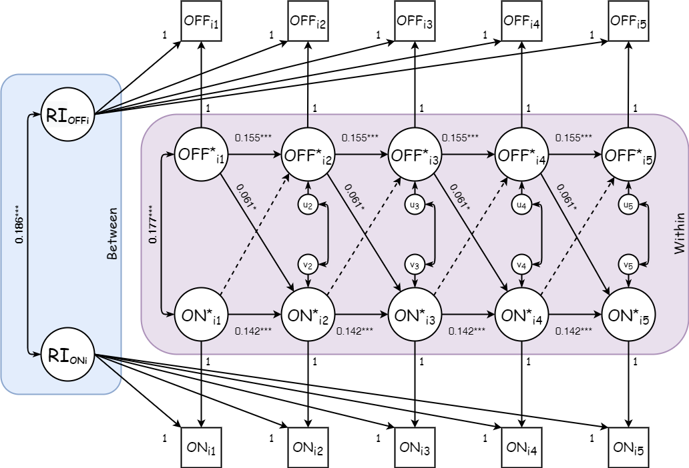

# Interpretacion de coeficientes


```{r include=FALSE}
library(dplyr)
library(tidyr)
library(data.table)
library(skimr)
library(MplusAutomation)
library(lavaan)
library(semoutput)
library(kableExtra)
library(texreg)


# Datos
load("data/elsoc_onoffline.Rdata")

fit <- readModels(target = "mplus", filefilter = "m_", recursive = F)
```

```{r}
screenreg(fit[[8]], type = "un",
          params = c("regression","undirected","variability"),
          summaries = c("ChiSqM_Value", "ChiSqM_PValue",
                        "CFI", "TLI", "RMSEA_Estimate",
                        "Observations"), 
          # custom.header	= list("RICLPM"=1),
          custom.model.names = c("RICLPM bidireccional constrenido"),
          digits = 3, single.row=TRUE)
```
```{r resultados, echo=FALSE, fig.align='center', fig.asp=.75, fig.cap='RI-CLPM full bidireccional constreñido para Participación Offline y Participación On-line', out.width='80%'}

```


## Componente Between
Ambos interceptos aleatorios tienen una varianza significativa. Esto implica que hay diferencias estables, entre individuos, respecto a sus puntajes esperados en participacion off-line y on-line.

Si la varianza no fuera distinta de 0, querria decir que han muy poca diferencias estables entre unidades y que cada individuo fluctua en torno a la misma gran media en el tiempo.

La covarianza entre los interceptos aleatorios es significativa ($.186, SE=.017$), lo que sugiere que los individuos que tienen una alta participacion online tambien tienen una alta participacion off-line.

## Componente Within
Recordemos que los componentes _within_ representan las desviaciones temporales en $t$ del individuo $i$ respecto a sus puntajes esperados (rasgos estables). 

Los efectos autorregresivos tanto para participacion off-line como para participacion online son significativos (Off-line: $\alpha_{t}=0.155; SE=.025$ On-line: $\gamma_{t}=0.142; SE=.023$). Los coeficientes indican el grado en el cual una variable continua incrementandose, en terminos de cambio individual, habiendo controlado por las caracteristicas individuales estables. De esta manera una desviacion de un punto sobre el nivel promedio de los individuos en participacion off-line persiste en la siguiente medicion como una desviacion positiva de 0.155 puntos respecto a su puntaje esperado. En el caso de la participacion on-line, una desviacion de un punto sobre el nivel promedio individual persiste durante la siguiente medicion como una desviacion positiva de 0.142 puntos sobre el nivel promedio individual.

Los efectos cross-lagged nos muestran que existe un efecto longitudinal intra-individuo de la participacion off-line sobre la participacion on-line ($\gamma_{t}=0.061; SE=0.026$), pero no hay evidencia de que exista un efecto longitudinal de la participacion on-line sobre la participacion off-line. 

Siendo asi, se observa que una desviacion de un punto sobre el nivel promedio de los individuos en participacion off-line predice una desviacion positiva de 0.061 puntos en la participacion on-line durante la siguiente medicion, controlando por las desviaciones respecto al puntaje esperado en participacion on-line.


