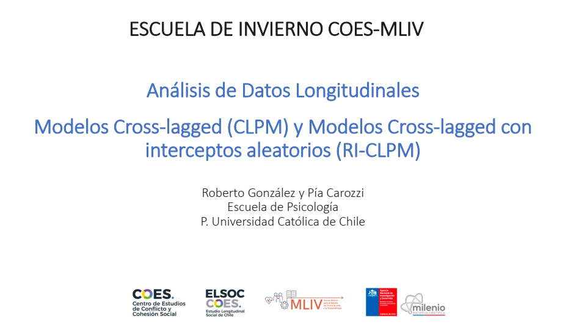

--- 
title: "Random Intercept Cross-Lagged Panel Model"
author: "-"
date: "Creado: 2021-03. Actualizado: `r Sys.Date()`"
knit: bookdown::render_book
site: bookdown::bookdown_site
documentclass: book
classoption: a4paper,12pt,twoside
lot: no
lof: no
link-citations: yes
bibliography: [book.bib, packages.bib]
biblio-style: apalike
colorlinks: yes
linktocpage: yes
linkcolor: black
urlcolor: blue
monofont: Source Code Pro
monofontoptions: Scale=0.7
description: " "
---

# Sesion RI-CLPM {-}

```{r portada, echo=FALSE, fig.align='center', fig.asp=.75, out.width='80%'}

```

<p xmlns:dct="http://purl.org/dc/terms/" xmlns:cc="http://creativecommons.org/ns#"><a rel="cc:attributionURL" href="https://pjcarozzi.github.io/riclpm/"><span rel="dct:title">Escuela de Invierno COES: Random Intercept Cross-Lagged Panel Model</span></a>, <a rel="cc:attributionURL" href="mailto:pjcarozzi@uc.cl"><span rel="cc:attributionName">Este documento</span></a> esta bajo una licencia de Creative Commons <a href="https://creativecommons.org/licenses/by-nc-sa/4.0/deed.es">Atribución-NoComercial-CompartirIgual 4.0 Internacional</a> (CC BY-NC-SA 4.0) </p> <p align="center"><a href="https://creativecommons.org/licenses/by-nc-sa/4.0/deed.es"></a></p>
