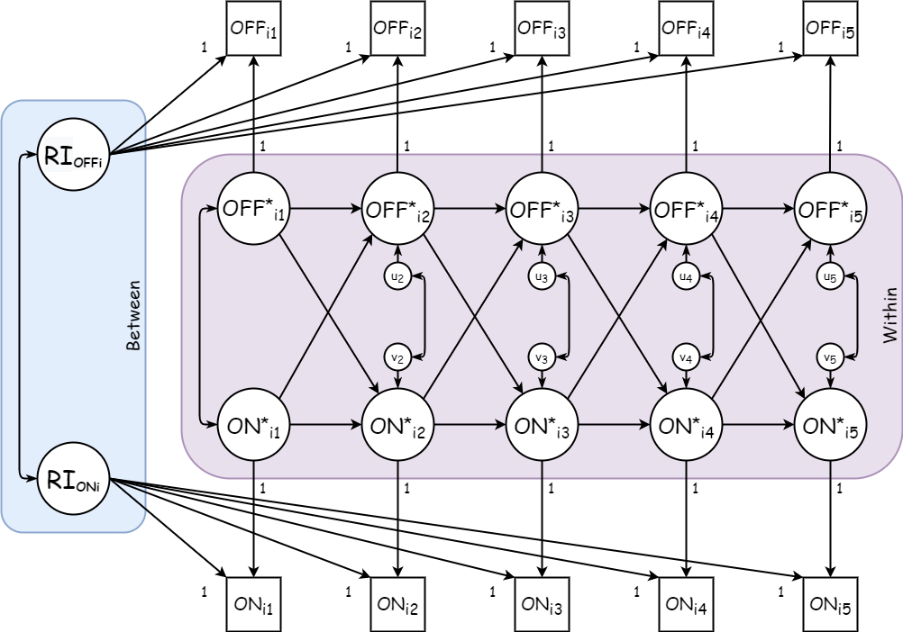
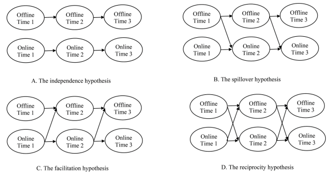
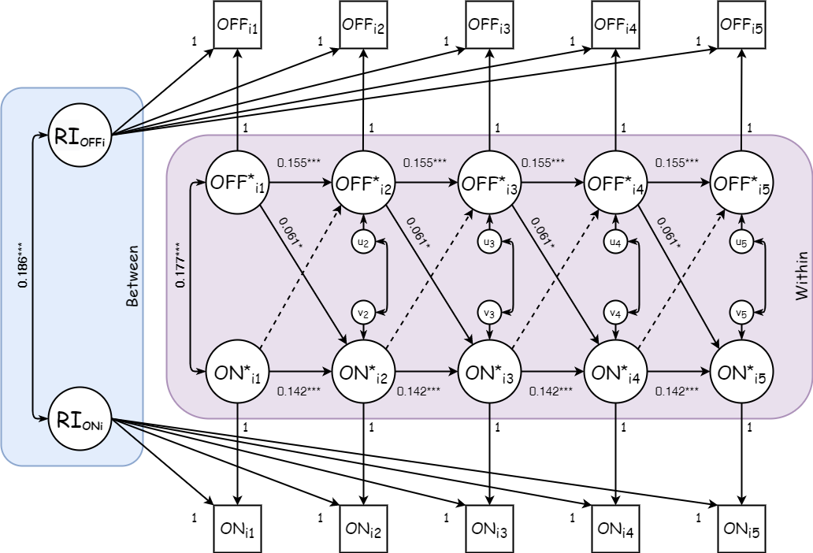

# Sesion RI-CLPM {-}

```{r, echo=FALSE, fig.align='center', fig.asp=.75, out.width='80%'}

```

<p xmlns:dct="http://purl.org/dc/terms/" xmlns:cc="http://creativecommons.org/ns#"><a rel="cc:attributionURL" href="www.completar.com"><span rel="dct:title">Escuela de Invierno COES: Random Intercept Cross-Lagged Panel Model</span></a>, <a rel="cc:attributionURL" href="mailto:pjcarozzi@uc.cl"><span rel="cc:attributionName">[Completar Atribución]</span></a> esta bajo una licencia de Creative Commons <a href="https://creativecommons.org/licenses/by-nc-sa/4.0/deed.es">Atribución-NoComercial-CompartirIgual 4.0 Internacional</a> (CC BY-NC-SA 4.0) </p> <p align="center"><a href="https://creativecommons.org/licenses/by-nc-sa/4.0/deed.es"></a></p>

# Modelo {#modelo}

Con datos de ELSOC, replicaremos los resultados de Chayinska, Miranda & Gonzalez (2021)

Analizaremos las relaciones longitudinales entre la participación política online y off-line a través de la estimación de RI-CLPM.

Las medidas que utilizaremos son las siguientes:

- Participacion politica on-line fue medida con un ítem unico en el cual se pregunta a los participantes reportar la frecuencias con la cual usan las redes sociales para expresar su opinión acerca de temas publicos durante los ultimos 12 meses (de 1 = nunca a 5 = muy frecuentemente).

- Participacion off-line en acciones colectivas fue medida con un item unico en el cual se pregunta a los participantes reportar que tan frecuentemente asistieron a una marcha o manifestacon politica durante los ultimos 12 meses (de 1 = nunca a 5 = muy frecuentemente).

La figura 1 representa el modelo que pondremos a prueba.

```{r modelo, echo=FALSE, fig.align='center', fig.asp=.75, fig.cap='RI-CLPM conceptual de las asociaciones entre Participación Offline y Participación On-line', out.width='80%'}

```

$OFF_{it}$ y $ON_{it}$ son los **puntajes observados** de los participantes en participación off-line y participacion on-line respectivamente, en cada una de las 5 olas de ELSOC, para la persona $i$.

$RI_{OFFi}$ y $RI_{ONi}$ son los respectivos **interceptos aleatorios**, las desviaciones del individuo $i$, en terminos de su puntaje esperado, respecto a la gran media de cada variable. Se trata de aquellos factores individuales que no varian en el tiempo y representan el componente _between_.

$OFF^{*}_{it}$ y $ON^{*}_{it}$ representan las desviaciones temporales en $t$ del individuo $i$ respecto a sus puntajes esperados. Constituyen las **fluctuaciones intra-persona**, el componente _within_.

Los estados iniciales en $t = 1$ (aqui $OFF^{*}_{i1}$ y $ON^{*}_{i1}$) son modelados como variables exógenas (sus varianzas y covarianzas son asumidas). Se tiene el supuesto de que los componentes _within_ están correlacionados entre si en cada $t$. 

$u_{it}$ y $v_{it}$ son los residuos. Por lo general, se tiene por supuesto que los residuos $u_{it}$ y $v_{it}$ están normalmente distribuidos y correlacionados entre sí, dentro de cada tiempo $t \geq 2$.

# Estimacion {#estimacion}

Para estimar los modelos usamos las siguientes librerias:

- `MplusAutomation` (Hallquist et al., 2021), si queremos estimar los modelos usando Mplus desde R, facilitando la creacion de modelos, estimacion de grupos de modelos, extraccion y tabulación de parametros y, en general, mantener un flujo de trabajo mas organizado.
- `lavaan` (Rosseel,2012), si queremos estimar los modelos directamente desde R. 


```{r include=FALSE}
library(dplyr)
library(tidyr)
library(data.table)
library(skimr)
library(MplusAutomation)
library(lavaan)
library(semoutput)
# library(semPlot)
# library(sjPlot)

library(kableExtra)
library(texreg)


# Datos
load("data/elsoc_onlineoffline.rdata")

elsoc[elsoc=="-999"] <- NA
elsoc[elsoc=="-888"] <- NA

elsoc <- data.table(elsoc)
elsoc <- elsoc[muestra=="1"]

names_old <- c("c08_02_w01","c08_02_w02","c08_02_w03","c08_02_w04","c08_02_w05",
               "c08_04_w01","c08_04_w02","c08_04_w03","c08_04_w04","c08_04_w05",
               "m0_edad_w01","m01_w01","m0_sexo_w01")

names_new <- c("marchw01","marchw02","marchw03","marchw04","marchw05",
               "redesw01","redesw02","redesw03","redesw04","redesw05",
               "edad","educ","sexo")

setnames(elsoc,names_old,names_new)
elsoc <- elsoc[, ..names_new]
rm(names_old,names_new)
elsoc <- as.data.frame(elsoc)
# save(elsoc, file = "data/elsoc_onoffline.Rdata")
```

Resumen de los datos:

```{r}
skim(elsoc)
```

## Sintaxis

Para especificar el RI-CLPM necesitamos 4 partes:

1. Componente _between_, los interceptos aleatorios. 

Los interceptos aleatorios son especificados creando variables latentes, con las medidas repetidas en $t$ como indicadores. Las cargas factoriales son fijadas en 1 porque RI-CLPM se basa en el supuesto de que los interceptos aleatorios tienen igual influencia en cada ocasión. Se asume que los interceptos aleatorios están correlacionados entre si. 

Mplus:
```
    ! Crear los componentes between
      RI_x BY marchw01@1 marchw02@1 marchw03@1 marchw04@1 marchw05@1;
      RI_y BY redesw01@1 redesw02@1 redesw03@1 redesw04@1 redesw05@1;
```

Lavaan:
```
    # Crear los componentes between
    RI_x =~ 1*marchw01 + 1*marchw02 + 1*marchw03 + 1*marchw04 + 1*marchw05
    RI_y =~ 1*redesw01 + 1*redesw02 + 1*redesw03 + 1*redesw04 + 1*redesw05
```

```{r, echo=FALSE, fig.align='center', fig.asp=.75, fig.cap='RI-CLPM conceptual de las asociaciones entre Participación Offline y Participación On-line', out.width='80%'}

```

2. Componente _within_, fluctuaciones intra-individuos. 

Las diferencias _within_ son especificadas como variables latentes explicadas por sus respectivas medidas observadas en cada ocasion.

Mplus:
```
    ! Crear los componentes within
      cx1 BY marchw01@1; 
      cx2 BY marchw02@1; 
      cx3 BY marchw03@1;
      cx4 BY marchw04@1; 
      cx5 BY marchw05@1;
      
      cy1 BY redesw01@1;
      cy2 BY redesw02@1;
      cy3 BY redesw03@1;
      cy4 BY redesw04@1;
      cy5 BY redesw05@1;
```

Lavaan:
```
    # Crear los componentes within
    cx1 =~ 1*marchw01
    cx2 =~ 1*marchw02
    cx3 =~ 1*marchw03
    cx4 =~ 1*marchw04
    cx5 =~ 1*marchw05
    
    cy1 =~ 1*redesw01
    cy2 =~ 1*redesw02
    cy3 =~ 1*redesw03
    cy4 =~ 1*redesw04
    cy5 =~ 1*redesw05
```

Se constriñen las varianzas del error de medicion a cero, no hay error de medicion.

Mplus:
```
    ! Constrenir las varianzas del error de medicion a cero
      marchw01 - redesw05@0;
```

Lavaan:
```
    # Constrenir las varianzas del error de medicion a cero
    marchw01 ~~ 0*marchw01
    marchw02 ~~ 0*marchw02
    marchw03 ~~ 0*marchw03
    marchw04 ~~ 0*marchw04
    marchw05 ~~ 0*marchw05
    
    redesw01 ~~ 0*redesw01
    redesw02 ~~ 0*redesw02
    redesw03 ~~ 0*redesw03
    redesw04 ~~ 0*redesw04
    redesw05 ~~ 0*redesw05
```

```{r, echo=FALSE, fig.align='center', fig.asp=.75, fig.cap='RI-CLPM conceptual de las asociaciones entre Participación Offline y Participación On-line', out.width='80%'}

```

3. Las regresiones lagged (autorregresivas y crosslagged) entre los componentes _within_

Mplus:
```
    ! Estimar los efectos lagged
      cx2 ON cx1 cy1; 
      cx3 ON cx2 cy2; 
      cx4 ON cx3 cy3; 
      cx5 ON cx4 cy4;
      cy2 ON cx1 cy1; 
      cy3 ON cx2 cy2; 
      cy4 ON cx3 cy3; 
      cy5 ON cx4 cy4;
```

Lavaan:
```
    # Estimar los efectos lagged
    cx2 ~ cx1 + cy1
    cx3 ~ cx2 + cy2
    cx4 ~ cx3 + cy3
    cx5 ~ cx4 + cy4
    cy2 ~ cx1 + cy1
    cy3 ~ cx2 + cy2
    cy4 ~ cx3 + cy3
    cy5 ~ cx4 + cy4
```

```{r, echo=FALSE, fig.align='center', fig.asp=.75, fig.cap='RI-CLPM conceptual de las asociaciones entre Participación Offline y Participación On-line', out.width='80%'}

```

4. Covarianzas relevantes en los componentes _between_ y _within_

Tanto en la primera ola (exogenas) como sus residuos desde la ola 2 se especifica que los componentes _within_ esten correlacionados dentro de cada ola.

Mplus:
```
    ! Estimar la covarianza entre los componentes within t=1
      cx1 WITH cy1;
    
    ! Estimar las covarianzas entre los residuos del componente within (innovations)
      cx2 WITH cy2; 
      cx3 WITH cy3; 
      cx4 WITH cy4; 
      cx5 WITH cy5;
```

Lavaan:
```
    # Estimar la covarianza entre los componentes within t=1
    cx1 ~~ cy1
    
    # Estimar las covarianzas entre los residuos del componente within (innovations)
    cx2 ~~ cy2
    cx3 ~~ cy3
    cx4 ~~ cy4
    cx5 ~~ cy5
```

En el componente _between_, se especifica que los interceptos aleatorios estan correlacionados.

Además, se indica que los componentes _within_ en la primera ola y los interceptos aleatorios no estan correlacionados. Las observaciones por lo general empiezan en un punto arbitrario del tiempo durante un proceso en desarrollo, por lo que no existen razones para asumir que estan relacionados.

Mplus:
```
    ! Estimar la covarianza entre los RI
      RI_x WITH RI_y;      
      
    ! Fijar la correlacion entre los RI y componentes within t=1 a cero 
      RI_x WITH cx1@0 cy1@0;
      RI_y WITH cx1@0 cy1@0;
```

Lavaan:
```
    # Estimar la varianza y covarianza entre los RI. 
    RI_x ~~ RI_x
    RI_y ~~ RI_y
    RI_x ~~ RI_y
    
    # Fijar la correlacion entre los RI y componentes within t=1 a cero 
    RI_x ~~ 0*cx1
    RI_x ~~ 0*cy1
    RI_y ~~ 0*cx1
    RI_y ~~ 0*cy1 
```

## Modelo basico 

<button class="tablinks" onclick="unrolltab(event, 'MPLUS')">MPLUS</button>
<button class="tablinks" onclick="unrolltab(event, 'lavaan')">lavaan</button>

::: {#MPLUS .tabcontent}

Creamos el objeto `model_mplus` que contiene el modelo usando la funcion `mplusObject( )`
```{r}
model_mplus <- mplusObject(
  TITLE = "RI CLPM;",
  
  ANALYSIS=
    "ESTIMATOR IS ML ;
    ITERATIONS = 5000;",
  
  MODEL = "
    ! Crear los componentes between
      RI_x BY marchw01@1 marchw02@1 marchw03@1 marchw04@1 marchw05@1;
      RI_y BY redesw01@1 redesw02@1 redesw03@1 redesw04@1 redesw05@1;
    
    ! Crear los componentes within
      cx1 BY marchw01@1; 
      cx2 BY marchw02@1; 
      cx3 BY marchw03@1;
      cx4 BY marchw04@1; 
      cx5 BY marchw05@1;
      
      cy1 BY redesw01@1;
      cy2 BY redesw02@1;
      cy3 BY redesw03@1;
      cy4 BY redesw04@1;
      cy5 BY redesw05@1;

    ! Constrenir las varianzas del error de medicion a cero
      marchw01 - redesw05@0;

    ! Estimar los efectos lagged
      cx2 ON cx1 cy1; 
      cx3 ON cx2 cy2; 
      cx4 ON cx3 cy3; 
      cx5 ON cx4 cy4;
      cy2 ON cx1 cy1; 
      cy3 ON cx2 cy2; 
      cy4 ON cx3 cy3; 
      cy5 ON cx4 cy4;
    
    ! Estimar la covarianza entre los componentes within t=1
      cx1 WITH cy1;
    
    ! Estimar las covarianzas entre los residuos del componente within (innovations)
      cx2 WITH cy2; 
      cx3 WITH cy3; 
      cx4 WITH cy4; 
      cx5 WITH cy5;
      
    ! Estimar la covarianza entre los RI
      RI_x WITH RI_y;      
      
    ! Fijar la correlacion entre los RI y componentes within t=1 a cero 
      RI_x WITH cx1@0 cy1@0;
      RI_y WITH cx1@0 cy1@0;
  "
,

  OUTPUT = "CINTERVAL sampstat mod stdyx tech1 tech4;",
  rdata = elsoc)
```

Estimamos el objeto `model_mplus` usando la funcion `mplusModeler( )`

```{r}
fit_mplus <- mplusModeler(model_mplus, modelout = "mplus/modelo_basico.inp", run = 1L)

screenreg(fit_mplus, type = "stdyx",
          # params = "regression",
          summaries = c("ChiSqM_Value", "ChiSqM_PValue",
                        "CFI", "TLI", "RMSEA_Estimate",
                        "Observations"), 
          # custom.header	= list("RICLPM"=1),
          custom.model.names = c("RICLPM basico"),
          digits = 3, single.row=TRUE)
```

:::
::: {#lavaan .tabcontent}

Creamos el objeto `model_lavaan` que contiene el modelo

```{r}
model_lavaan <- '
    # Crear los componentes between
    RI_x =~ 1*marchw01  + 1*marchw02 + 1*marchw03 + 1*marchw04 + 1*marchw05
    RI_y =~ 1*redesw01 + 1*redesw02 + 1*redesw03 + 1*redesw04 + 1*redesw05
    
    # Crear los componentes within
    cx1 =~ 1*marchw01
    cx2 =~ 1*marchw02
    cx3 =~ 1*marchw03
    cx4 =~ 1*marchw04
    cx5 =~ 1*marchw05
    
    cy1 =~ 1*redesw01
    cy2 =~ 1*redesw02
    cy3 =~ 1*redesw03
    cy4 =~ 1*redesw04
    cy5 =~ 1*redesw05
    
    # Constrenir las varianzas del error de medicion a cero
    marchw01 ~~ 0*marchw01
    marchw02 ~~ 0*marchw02
    marchw03 ~~ 0*marchw03
    marchw04 ~~ 0*marchw04
    marchw05 ~~ 0*marchw05
    
    redesw01 ~~ 0*redesw01
    redesw02 ~~ 0*redesw02
    redesw03 ~~ 0*redesw03
    redesw04 ~~ 0*redesw04
    redesw05 ~~ 0*redesw05
    
    # Estimar los efectos lagged
    cx2 ~ cx1 + cy1
    cx3 ~ cx2 + cy2
    cx4 ~ cx3 + cy3
    cx5 ~ cx4 + cy4
    cy2 ~ cx1 + cy1
    cy3 ~ cx2 + cy2
    cy4 ~ cx3 + cy3
    cy5 ~ cx4 + cy4
    
    # Estimar la covarianza entre los componentes within t=1
    cx1 ~~ cy1
    
    # Estimar las covarianzas entre los residuos del componente within (innovations)
    cx2 ~~ cy2
    cx3 ~~ cy3
    cx4 ~~ cy4
    cx5 ~~ cy5
    
    # Estimar la varianza y covarianza entre los RI. 
    RI_x ~~ RI_x
    RI_y ~~ RI_y
    RI_x ~~ RI_y
    
    # Fijar la correlacion entre los RI y componentes within t=1 a cero 
    RI_x ~~ 0*cx1
    RI_x ~~ 0*cy1
    RI_y ~~ 0*cx1
    RI_y ~~ 0*cy1 
'
```

Estimamos el objeto `model_lavaan` usando la funcion `sem( )`

```{r warning=FALSE}
fit_lavaan <- sem(model_lavaan, data=elsoc, missing = "fiml")

summary(fit_lavaan, fit.measures=TRUE, standardized = T)
```

:::

# Modelos anidados {#nestedm}

```{r include=FALSE}
library(dplyr)
library(tidyr)
library(data.table)
library(skimr)
library(MplusAutomation)
library(lavaan)
library(semoutput)
library(kableExtra)
library(texreg)


# Datos
load("data/elsoc_onoffline.Rdata")
```

La estimacion usualmente sigue una estrategia de modelos anidados entre los cuales se compara su bondad de ajuste.

Recordemos nuestras hipotesis

```{r nice-fig, echo=FALSE, fig.align='center', fig.asp=.75, fig.cap='Hipotesis en torno a las relaciones entre Participación Offline y Participación On-line', out.width='80%'}

```

De esta manera estimamos:

1. El modelo A contiene sólo los paths autorregresivos.
2. El modelo B unidireccional. Contiene los paths autorregresivos y los paths cross-lagged (forward).
3. El modelo C unidireccional. Contiene los paths autorregresivos y los paths cross-lagged (reverse).
4. El modelo D bidireccional. Contiene los paths autorregresivos y los paths cross-lagged en ambas direcciones.

Adicionalmente, en cada uno de estos modelos, se comparan las bondades de ajuste entre modelos estimados libremente y modelos constreñidos para testear si los efectos son iguales en el tiempo.


### Sintaxis constraints
En Mplus, las restricciones al modelo se realizan asignando etiquetas a los parametros y utilizando la misma etiqueta para los parametros que quedaran constreñidos a ser iguales.

Mplus:
```
    ! Estimar los efectos lagged (constreñidos en el tiempo)
      cx2 ON cx1 cy1 (a d); 
      cx3 ON cx2 cy2 (a d); 
      cx4 ON cx3 cy3 (a d); 
      cx5 ON cx4 cy4 (a d);
      cy2 ON cx1 cy1 (c b); 
      cy3 ON cx2 cy2 (c b); 
      cy4 ON cx3 cy3 (c b); 
      cy5 ON cx4 cy4 (c b);
```

En lavaan, las restricciones al modelo se logran a traves de pre-multiplicacion: Se agrega a cada parametro un numero al cual queremos fijarlo o una etiqueta, junto a un asterisco, y luego se indica el parametro en la especificacion del modelo. Para constreñir la igualdad entre parametros se utiliza frente a ellos el mismo numero o la misma etiqueta.

Lavaan:
```
    # Estimar los efectos lagged (constreñidos en el tiempo)
    cx2 ~ a*cx1 + d*cy1
    cx3 ~ a*cx2 + d*cy2
    cx4 ~ a*cx3 + d*cy3
    cx5 ~ a*cx4 + d*cy4
    cy2 ~ c*cx1 + b*cy1
    cy3 ~ c*cx2 + b*cy2
    cy4 ~ c*cx3 + b*cy3
    cy5 ~ c*cx4 + b*cy4
```

Estimamos los modelos:

<button class="tablinks" onclick="unrolltab(event, 'A1')">Modelo A1</button>
<button class="tablinks" onclick="unrolltab(event, 'A2')">Modelo A2</button>
<button class="tablinks" onclick="unrolltab(event, 'B1')">Modelo B1</button>
<button class="tablinks" onclick="unrolltab(event, 'B2')">Modelo B2</button>
<button class="tablinks" onclick="unrolltab(event, 'C1')">Modelo C1</button>
<button class="tablinks" onclick="unrolltab(event, 'C2')">Modelo C2</button>
<button class="tablinks" onclick="unrolltab(event, 'D1')">Modelo D1</button>
<button class="tablinks" onclick="unrolltab(event, 'D2')">Modelo D2</button>
<button class="tablinks" onclick="unrolltab(event, 'Run')">Run</button>


::: {#A1 .tabcontent}

```{r}
modelos <- list()
modelos[["m_A1"]] <- mplusObject(
  TITLE = "RI CLPM - A1;",
  
  ANALYSIS=
    "ESTIMATOR = mlr;
    ITERATIONS = 5000;",
  
  MODEL = "
    ! Crear los componentes between
      RI_x BY marchw01@1 marchw02@1 marchw03@1 marchw04@1 marchw05@1;
      RI_y BY redesw01@1 redesw02@1 redesw03@1 redesw04@1 redesw05@1;
    
    ! Crear los componentes within
      cx1 BY marchw01@1; 
      cx2 BY marchw02@1; 
      cx3 BY marchw03@1;
      cx4 BY marchw04@1; 
      cx5 BY marchw05@1;
      
      cy1 BY redesw01@1;
      cy2 BY redesw02@1;
      cy3 BY redesw03@1;
      cy4 BY redesw04@1;
      cy5 BY redesw05@1;

    ! Constrenir las varianzas del error de medicion a cero
      marchw01 - redesw05@0;

    ! Estimar los efectos lagged (autorregresivos)
      cx2 ON cx1; 
      cx3 ON cx2; 
      cx4 ON cx3; 
      cx5 ON cx4;
      cy2 ON cy1; 
      cy3 ON cy2; 
      cy4 ON cy3; 
      cy5 ON cy4;
    
    ! Estimar la covarianza entre los componentes within t=1
      cx1 WITH cy1;
    
    ! Estimar las covarianzas entre los residuos del componente within (innovations)
      cx2 WITH cy2; 
      cx3 WITH cy3; 
      cx4 WITH cy4; 
      cx5 WITH cy5;
      
    ! Estimar la covarianza entre los RI
      RI_x WITH RI_y;      
      
    ! Fijar la correlacion entre los RI y componentes within t=1 a cero 
      RI_x WITH cx1@0 cy1@0;
      RI_y WITH cx1@0 cy1@0;
  "
,

  OUTPUT = "CINTERVAL sampstat mod stdyx tech1 tech4;",
  rdata = elsoc)
```

:::


::: {#A2 .tabcontent}

```{r}
modelos[["m_A2"]] <- mplusObject(
  TITLE = "RI CLPM - A2;",
  
  ANALYSIS=
    "ESTIMATOR = mlr;
    ITERATIONS = 5000;",
  
  MODEL = "
    ! Crear los componentes between
      RI_x BY marchw01@1 marchw02@1 marchw03@1 marchw04@1 marchw05@1;
      RI_y BY redesw01@1 redesw02@1 redesw03@1 redesw04@1 redesw05@1;
    
    ! Crear los componentes within
      cx1 BY marchw01@1; 
      cx2 BY marchw02@1; 
      cx3 BY marchw03@1;
      cx4 BY marchw04@1; 
      cx5 BY marchw05@1;
      
      cy1 BY redesw01@1;
      cy2 BY redesw02@1;
      cy3 BY redesw03@1;
      cy4 BY redesw04@1;
      cy5 BY redesw05@1;

    ! Constrenir las varianzas del error de medicion a cero
      marchw01 - redesw05@0;

    ! Estimar los efectos lagged (autorregresivos)
      cx2 ON cx1 (a); 
      cx3 ON cx2 (a); 
      cx4 ON cx3 (a); 
      cx5 ON cx4 (a);
      cy2 ON cy1 (b); 
      cy3 ON cy2 (b); 
      cy4 ON cy3 (b); 
      cy5 ON cy4 (b);
    
    ! Estimar la covarianza entre los componentes within t=1
      cx1 WITH cy1;
    
    ! Estimar las covarianzas entre los residuos del componente within (innovations)
      cx2 WITH cy2; 
      cx3 WITH cy3; 
      cx4 WITH cy4; 
      cx5 WITH cy5;
      
    ! Estimar la covarianza entre los RI
      RI_x WITH RI_y;      
      
    ! Fijar la correlacion entre los RI y componentes within t=1 a cero 
      RI_x WITH cx1@0 cy1@0;
      RI_y WITH cx1@0 cy1@0;
  "
,

  OUTPUT = "CINTERVAL sampstat mod stdyx tech1 tech4;",
  rdata = elsoc)
```

:::

::: {#B1 .tabcontent}

```{r}
modelos[["m_B1"]] <- mplusObject(
  TITLE = "RI CLPM - B1;",
  
  ANALYSIS=
    "ESTIMATOR = mlr;
    ITERATIONS = 5000;",
  
  MODEL = "
    ! Crear los componentes between
      RI_x BY marchw01@1 marchw02@1 marchw03@1 marchw04@1 marchw05@1;
      RI_y BY redesw01@1 redesw02@1 redesw03@1 redesw04@1 redesw05@1;
    
    ! Crear los componentes within
      cx1 BY marchw01@1; 
      cx2 BY marchw02@1; 
      cx3 BY marchw03@1;
      cx4 BY marchw04@1; 
      cx5 BY marchw05@1;
      
      cy1 BY redesw01@1;
      cy2 BY redesw02@1;
      cy3 BY redesw03@1;
      cy4 BY redesw04@1;
      cy5 BY redesw05@1;

    ! Constrenir las varianzas del error de medicion a cero
      marchw01 - redesw05@0;

    ! Estimar los efectos lagged
      cx2 ON cx1; 
      cx3 ON cx2; 
      cx4 ON cx3; 
      cx5 ON cx4;
      cy2 ON cx1 cy1; 
      cy3 ON cx2 cy2; 
      cy4 ON cx3 cy3; 
      cy5 ON cx4 cy4;
    
    ! Estimar la covarianza entre los componentes within t=1
      cx1 WITH cy1;
    
    ! Estimar las covarianzas entre los residuos del componente within (innovations)
      cx2 WITH cy2; 
      cx3 WITH cy3; 
      cx4 WITH cy4; 
      cx5 WITH cy5;
      
    ! Estimar la covarianza entre los RI
      RI_x WITH RI_y;      
      
    ! Fijar la correlacion entre los RI y componentes within t=1 a cero 
      RI_x WITH cx1@0 cy1@0;
      RI_y WITH cx1@0 cy1@0;
  "
,

  OUTPUT = "CINTERVAL sampstat mod stdyx tech1 tech4;",
  rdata = elsoc)
```
:::

::: {#B2 .tabcontent}

```{r}
modelos[["m_B2"]] <- mplusObject(
  TITLE = "RI CLPM - B2;",
  
  ANALYSIS=
    "ESTIMATOR = mlr;
    ITERATIONS = 5000;",
  
  MODEL = "
    ! Crear los componentes between
      RI_x BY marchw01@1 marchw02@1 marchw03@1 marchw04@1 marchw05@1;
      RI_y BY redesw01@1 redesw02@1 redesw03@1 redesw04@1 redesw05@1;
    
    ! Crear los componentes within
      cx1 BY marchw01@1; 
      cx2 BY marchw02@1; 
      cx3 BY marchw03@1;
      cx4 BY marchw04@1; 
      cx5 BY marchw05@1;
      
      cy1 BY redesw01@1;
      cy2 BY redesw02@1;
      cy3 BY redesw03@1;
      cy4 BY redesw04@1;
      cy5 BY redesw05@1;

    ! Constrenir las varianzas del error de medicion a cero
      marchw01 - redesw05@0;

    ! Estimar los efectos lagged
      cx2 ON cx1 (a);
      cx3 ON cx2 (a);
      cx4 ON cx3 (a);
      cx5 ON cx4 (a);
      cy2 ON cx1 cy1 (c b);
      cy3 ON cx2 cy2 (c b);
      cy4 ON cx3 cy3 (c b);
      cy5 ON cx4 cy4 (c b);
    
    ! Estimar la covarianza entre los componentes within t=1
      cx1 WITH cy1;
    
    ! Estimar las covarianzas entre los residuos del componente within (innovations)
      cx2 WITH cy2; 
      cx3 WITH cy3; 
      cx4 WITH cy4; 
      cx5 WITH cy5;
      
    ! Estimar la covarianza entre los RI
      RI_x WITH RI_y;      
      
    ! Fijar la correlacion entre los RI y componentes within t=1 a cero 
      RI_x WITH cx1@0 cy1@0;
      RI_y WITH cx1@0 cy1@0;
  "
,

  OUTPUT = "CINTERVAL sampstat mod stdyx tech1 tech4;",
  rdata = elsoc)
```
:::

::: {#C1 .tabcontent}

```{r}
modelos[["m_C1"]] <- mplusObject(
  TITLE = "RI CLPM - C1;",
  
  ANALYSIS=
    "ESTIMATOR = mlr;
    ITERATIONS = 5000;",
  
  MODEL = "
    ! Crear los componentes between
      RI_x BY marchw01@1 marchw02@1 marchw03@1 marchw04@1 marchw05@1;
      RI_y BY redesw01@1 redesw02@1 redesw03@1 redesw04@1 redesw05@1;
    
    ! Crear los componentes within
      cx1 BY marchw01@1; 
      cx2 BY marchw02@1; 
      cx3 BY marchw03@1;
      cx4 BY marchw04@1; 
      cx5 BY marchw05@1;
      
      cy1 BY redesw01@1;
      cy2 BY redesw02@1;
      cy3 BY redesw03@1;
      cy4 BY redesw04@1;
      cy5 BY redesw05@1;

    ! Constrenir las varianzas del error de medicion a cero
      marchw01 - redesw05@0;

    ! Estimar los efectos lagged
      cx2 ON cx1 cy1; 
      cx3 ON cx2 cy2; 
      cx4 ON cx3 cy3; 
      cx5 ON cx4 cy4;
      cy2 ON cy1; 
      cy3 ON cy2; 
      cy4 ON cy3; 
      cy5 ON cy4;
    
    ! Estimar la covarianza entre los componentes within t=1
      cx1 WITH cy1;
    
    ! Estimar las covarianzas entre los residuos del componente within (innovations)
      cx2 WITH cy2; 
      cx3 WITH cy3; 
      cx4 WITH cy4; 
      cx5 WITH cy5;
      
    ! Estimar la covarianza entre los RI
      RI_x WITH RI_y;      
      
    ! Fijar la correlacion entre los RI y componentes within t=1 a cero 
      RI_x WITH cx1@0 cy1@0;
      RI_y WITH cx1@0 cy1@0;
  "
,

  OUTPUT = "CINTERVAL sampstat mod stdyx tech1 tech4;",
  rdata = elsoc)
```
:::

::: {#C2 .tabcontent}

```{r}
modelos[["m_C2"]] <- mplusObject(
  TITLE = "RI CLPM - C2;",
  
  ANALYSIS=
    "ESTIMATOR = mlr;
    ITERATIONS = 5000;",
  
  MODEL = "
    ! Crear los componentes between
      RI_x BY marchw01@1 marchw02@1 marchw03@1 marchw04@1 marchw05@1;
      RI_y BY redesw01@1 redesw02@1 redesw03@1 redesw04@1 redesw05@1;
    
    ! Crear los componentes within
      cx1 BY marchw01@1; 
      cx2 BY marchw02@1; 
      cx3 BY marchw03@1;
      cx4 BY marchw04@1; 
      cx5 BY marchw05@1;
      
      cy1 BY redesw01@1;
      cy2 BY redesw02@1;
      cy3 BY redesw03@1;
      cy4 BY redesw04@1;
      cy5 BY redesw05@1;

    ! Constrenir las varianzas del error de medicion a cero
      marchw01 - redesw05@0;

    ! Estimar los efectos lagged
      cx2 ON cx1 cy1 (a d);
      cx3 ON cx2 cy2 (a d);
      cx4 ON cx3 cy3 (a d);
      cx5 ON cx4 cy4 (a d);
      cy2 ON cy1 (b);
      cy3 ON cy2 (b);
      cy4 ON cy3 (b);
      cy5 ON cy4 (b);
    
    ! Estimar la covarianza entre los componentes within t=1
      cx1 WITH cy1;
    
    ! Estimar las covarianzas entre los residuos del componente within (innovations)
      cx2 WITH cy2; 
      cx3 WITH cy3; 
      cx4 WITH cy4; 
      cx5 WITH cy5;
      
    ! Estimar la covarianza entre los RI
      RI_x WITH RI_y;      
      
    ! Fijar la correlacion entre los RI y componentes within t=1 a cero 
      RI_x WITH cx1@0 cy1@0;
      RI_y WITH cx1@0 cy1@0;
  "
,

  OUTPUT = "CINTERVAL sampstat mod stdyx tech1 tech4;",
  rdata = elsoc)
```
:::

::: {#D1 .tabcontent}

```{r}
modelos[["m_D1"]] <- mplusObject(
  TITLE = "RI CLPM - D1;",
  
  ANALYSIS=
    "ESTIMATOR = mlr;
    ITERATIONS = 5000;",
  
  MODEL = "
    ! Crear los componentes between
      RI_x BY marchw01@1 marchw02@1 marchw03@1 marchw04@1 marchw05@1;
      RI_y BY redesw01@1 redesw02@1 redesw03@1 redesw04@1 redesw05@1;
    
    ! Crear los componentes within
      cx1 BY marchw01@1; 
      cx2 BY marchw02@1; 
      cx3 BY marchw03@1;
      cx4 BY marchw04@1; 
      cx5 BY marchw05@1;
      
      cy1 BY redesw01@1;
      cy2 BY redesw02@1;
      cy3 BY redesw03@1;
      cy4 BY redesw04@1;
      cy5 BY redesw05@1;

    ! Constrenir las varianzas del error de medicion a cero
      marchw01 - redesw05@0;

    ! Estimar los efectos lagged
      cx2 ON cx1 cy1; 
      cx3 ON cx2 cy2; 
      cx4 ON cx3 cy3; 
      cx5 ON cx4 cy4;
      cy2 ON cx1 cy1; 
      cy3 ON cx2 cy2; 
      cy4 ON cx3 cy3; 
      cy5 ON cx4 cy4;
    
    ! Estimar la covarianza entre los componentes within t=1
      cx1 WITH cy1;
    
    ! Estimar las covarianzas entre los residuos del componente within (innovations)
      cx2 WITH cy2; 
      cx3 WITH cy3; 
      cx4 WITH cy4; 
      cx5 WITH cy5;
      
    ! Estimar la covarianza entre los RI
      RI_x WITH RI_y;      
      
    ! Fijar la correlacion entre los RI y componentes within t=1 a cero 
      RI_x WITH cx1@0 cy1@0;
      RI_y WITH cx1@0 cy1@0;
  "
,

  OUTPUT = "CINTERVAL sampstat mod stdyx tech1 tech4;",
  rdata = elsoc)
```
:::

::: {#D2 .tabcontent}

```{r}
modelos[["m_D2"]] <- mplusObject(
  TITLE = "RI CLPM - D2;",
  
  ANALYSIS=
    "ESTIMATOR = mlr;
    ITERATIONS = 5000;",
  
  MODEL = "
    ! Crear los componentes between
      RI_x BY marchw01@1 marchw02@1 marchw03@1 marchw04@1 marchw05@1;
      RI_y BY redesw01@1 redesw02@1 redesw03@1 redesw04@1 redesw05@1;
    
    ! Crear los componentes within
      cx1 BY marchw01@1; 
      cx2 BY marchw02@1; 
      cx3 BY marchw03@1;
      cx4 BY marchw04@1; 
      cx5 BY marchw05@1;
      
      cy1 BY redesw01@1;
      cy2 BY redesw02@1;
      cy3 BY redesw03@1;
      cy4 BY redesw04@1;
      cy5 BY redesw05@1;

    ! Constrenir las varianzas del error de medicion a cero
      marchw01 - redesw05@0;

    ! Estimar los efectos lagged
      cx2 ON cx1 cy1 (a d); 
      cx3 ON cx2 cy2 (a d); 
      cx4 ON cx3 cy3 (a d); 
      cx5 ON cx4 cy4 (a d);
      cy2 ON cx1 cy1 (c b); 
      cy3 ON cx2 cy2 (c b); 
      cy4 ON cx3 cy3 (c b); 
      cy5 ON cx4 cy4 (c b);
    
    ! Estimar la covarianza entre los componentes within t=1
      cx1 WITH cy1;
    
    ! Estimar las covarianzas entre los residuos del componente within (innovations)
      cx2 WITH cy2; 
      cx3 WITH cy3; 
      cx4 WITH cy4; 
      cx5 WITH cy5;
      
    ! Estimar la covarianza entre los RI
      RI_x WITH RI_y;      
      
    ! Fijar la correlacion entre los RI y componentes within t=1 a cero 
      RI_x WITH cx1@0 cy1@0;
      RI_y WITH cx1@0 cy1@0;
  "
,

  OUTPUT = "CINTERVAL sampstat mod stdyx tech1 tech4;",
  rdata = elsoc)
```
:::


::: {#Run .tabcontent}

```{r}
for (i in seq(names(modelos))) {
  mplusModeler(modelos[[i]], 
               modelout = paste0("mplus/",names(modelos)[i],".inp", sep=""), 
               run = 1L, quiet=T)
}

fit <- readModels(target = "mplus", filefilter = "m_", recursive = F)
```
:::

## Indicadores de bondad de ajuste

### Extraccion

Usamos la siguiente funcion para extraer indicadores de bondad de ajuste:

<button class="tablinks" onclick="unrolltab(event, 'gof.measures')">gof.measures</button>

::: {#gof.measures .tabcontent}
```{r}
## GOF function:
gof.measures  = function(fit_list){
  gof <- list()
  for (i in 1:length(fit_list)) {
    model        <- gsub(".out","",names(fit_list)[i])
    chisq_df     <- fit_list[[i]][["summaries"]][["ChiSqM_DF"]]
    chisq_value  <- fit_list[[i]][["summaries"]][["ChiSqM_Value"]]
    chisq_pvalue <- fit_list[[i]][["summaries"]][["ChiSqM_PValue"]]
    CFI          <- fit_list[[i]][["summaries"]][["CFI"]]
    TLI          <- fit_list[[i]][["summaries"]][["TLI"]]
    RMSEA        <- fit_list[[i]][["summaries"]][["RMSEA_Estimate"]]
    SRMR         <- fit_list[[i]][["summaries"]][["SRMR"]]
    AIC          <- fit_list[[i]][["summaries"]][["AIC"]]
    BIC          <- fit_list[[i]][["summaries"]][["BIC"]]
    aBIC         <- fit_list[[i]][["summaries"]][["aBIC"]]
    LL           <- fit_list[[i]][["summaries"]][["LL"]]
    free_par     <- fit_list[[i]][["summaries"]][["Parameters"]]
    LL_correctf  <- fit_list[[i]][["summaries"]][["LLCorrectionFactor"]]

    gof[[model]] <- data.frame(model,chisq_df,chisq_value,chisq_pvalue,
                               CFI,TLI,RMSEA,SRMR,
                               AIC,BIC,aBIC,
                               LL,free_par,LL_correctf)
    }
  gof <- dplyr::bind_rows(gof)
  return(gof)
}
```
:::

`gof.measures()` solo requiere que se especifique como input una lista de modelos de tipo "mplus.model.list". Corremos `gof.measures()` usando nuestra lista de modelos `fit` para reunir los indicadores en un dataframe llamado `dtgof`.

```{r}
dtgof <- gof.measures(fit)

dtgof %>% select(-LL,-free_par,-LL_correctf) %>% 
  kbl(digits = 2) %>%
  kable_styling(bootstrap_options = c("striped", "hover", "condensed", "responsive"))
```

## Comparacion de bondad de ajuste

En la tabla hemos dejado fuera del reporte las columnas Log-likelihood, su correccion y el numero de parametros libres. Estos nos serviran para calcular otros tests para comparar modelos. Para hacerlo, usamos la siguiente funcion:


<button class="tablinks" onclick="unrolltab(event, 'gof.comparison')">gof.comparison</button>

::: {#gof.comparison .tabcontent}
```{r}
gof.comparison  = function(data,fuller,nested){
  dt_gof <- data.table::data.table(data.table::copy(data)) 
  
  comparison  <- paste0(nested," vs. ",fuller, sep="")
  CFI_delta   <- dt_gof[model==nested,CFI] - dt_gof[model==fuller,CFI]
  TLI_delta   <- dt_gof[model==nested,TLI] - dt_gof[model==fuller,TLI]
  RMSEA_delta <- dt_gof[model==nested,RMSEA] - dt_gof[model==fuller,RMSEA]
  SRMR_delta  <- dt_gof[model==nested,SRMR] - dt_gof[model==fuller,SRMR]
  AIC_delta   <- dt_gof[model==nested,AIC] - dt_gof[model==fuller,AIC]
  BIC_delta   <- dt_gof[model==nested,BIC] - dt_gof[model==fuller,BIC]
  aBIC_delta  <- dt_gof[model==nested,aBIC] - dt_gof[model==fuller,aBIC]
  
  free_LLcorf_nested <- dt_gof[model==nested,free_par]*dt_gof[model==nested,LL_correctf]
  free_LLcorf_fuller <- dt_gof[model==fuller,free_par]*dt_gof[model==fuller,LL_correctf]
  free_par_delta <- dt_gof[model==nested,free_par]-dt_gof[model==fuller,free_par]
  CD <- (free_LLcorf_nested-free_LLcorf_fuller)/free_par_delta
  
  LL_delta <- dt_gof[model==nested,LL]-dt_gof[model==fuller,LL]
  TRd <- (-2*LL_delta)/CD
  TRd_df <- dt_gof[model==fuller,free_par]-dt_gof[model==nested,free_par]
  TRd_pvalue <- pchisq(TRd, TRd_df, lower.tail = F)
  
  comp <- data.frame(nested,fuller,comparison,CFI_delta,TLI_delta,RMSEA_delta,SRMR_delta,AIC_delta,BIC_delta,aBIC_delta,CD,TRd,TRd_df,TRd_pvalue)
  return(comp)
}
```
:::

`gof.comparison()` sirve para comparar pares de modelos.

Por ejemplo, comparamos los modelos "m_d1" y "m_d2".

```{r}
gof.comparison(dtgof,fuller="m_d1",nested="m_d2") %>% select(-comparison) %>% 
  kbl(digits = 2) %>%
  kable_styling(bootstrap_options = c("striped", "hover", "condensed", "responsive"))
```

Podemos reunir todas las comparaciones en un mismo dataframe y visualizarlas en una misma tabla.
```{r}
gof_comp <- dplyr::bind_rows(
gof.comparison(dtgof,fuller="m_a1",nested="m_a2"),
gof.comparison(dtgof,fuller="m_b1",nested="m_b2"),
gof.comparison(dtgof,nested="m_a2",fuller="m_b2"),
gof.comparison(dtgof,fuller="m_c1",nested="m_c2"),
gof.comparison(dtgof,nested="m_a2",fuller="m_c2"),
gof.comparison(dtgof,fuller="m_d1",nested="m_d2"),
gof.comparison(dtgof,nested="m_a2",fuller="m_d2"),
gof.comparison(dtgof,nested="m_b2",fuller="m_d2"),
gof.comparison(dtgof,nested="m_c2",fuller="m_d2"))

gof_comp %>% select(-comparison) %>% 
  kbl(digits = 3) %>%
  kable_styling(bootstrap_options = c("striped", "hover", "condensed", "responsive"))
```

Rutkowski & Svetina (2014), Chen (2007)

- Comparacion entre modelos libres y constreñidos. Si los modelos constreñidos no cambian sustancialmente el CFI y RMSEA, se recomienda retener el modelo mas parsimonioso (constreñido).

- Comparacion entre modelos distintos. Para muestras mayores a 300 casos, se recomienda que:
   - $\Delta CFI < 0.02$
   - $\Delta RMSEA < 0.03$

# Interpretacion de coeficientes


```{r include=FALSE}
library(dplyr)
library(tidyr)
library(data.table)
library(skimr)
library(MplusAutomation)
library(lavaan)
library(semoutput)
library(kableExtra)
library(texreg)


# Datos
load("data/elsoc_onoffline.Rdata")

fit <- readModels(target = "mplus", filefilter = "m_", recursive = F)
```

```{r}
screenreg(fit[[8]], type = "un",
          params = c("regression","undirected","variability"),
          summaries = c("ChiSqM_Value", "ChiSqM_PValue",
                        "CFI", "TLI", "RMSEA_Estimate",
                        "Observations"), 
          # custom.header	= list("RICLPM"=1),
          custom.model.names = c("RICLPM bidireccional constrenido"),
          digits = 3, single.row=TRUE)
```
```{r resultados, echo=FALSE, fig.align='center', fig.asp=.75, fig.cap='RI-CLPM full bidireccional constreñido para Participación Offline y Participación On-line', out.width='80%'}

```


## Componente Between
Ambos interceptos aleatorios tienen una varianza significativa. Esto implica que hay diferencias estables, entre individuos, respecto a sus puntajes esperados en participacion off-line y on-line.

Si la varianza no fuera distinta de 0, querria decir que han muy poca diferencias estables entre unidades y que cada individuo fluctua en torno a la misma gran media en el tiempo.

La covarianza entre los interceptos aleatorios es significativa ($.186, SE=.017$), lo que sugiere que los individuos que tienen una alta participacion online tambien tienen una alta participacion off-line.

## Componente Within
Recordemos que los componentes _within_ representan las desviaciones temporales en $t$ del individuo $i$ respecto a sus puntajes esperados (rasgos estables). 

Los efectos autorregresivos tanto para participacion off-line como para participacion online son significativos (Off-line: $\alpha_{t}=0.155; SE=.025$ On-line: $\gamma_{t}=0.142; SE=.023$). Los coeficientes indican el grado en el cual una variable continua incrementandose, en terminos de cambio individual, habiendo controlado por las caracteristicas individuales estables. De esta manera una desviacion de un punto sobre el nivel promedio de los individuos en participacion off-line persiste en la siguiente medicion como una desviacion positiva de 0.155 puntos respecto a su puntaje esperado. En el caso de la participacion on-line, una desviacion de un punto sobre el nivel promedio individual persiste durante la siguiente medicion como una desviacion positiva de 0.142 puntos sobre el nivel promedio individual.

Los efectos cross-lagged nos muestran que existe un efecto longitudinal intra-individuo de la participacion off-line sobre la participacion on-line ($\gamma_{t}=0.061; SE=0.026$), pero no hay evidencia de que exista un efecto longitudinal de la participacion on-line sobre la participacion off-line. 

Siendo asi, se observa que una desviacion de un punto sobre el nivel promedio de los individuos en participacion off-line predice una desviacion positiva de 0.061 puntos en la participacion on-line durante la siguiente medicion, controlando por las desviaciones respecto al puntaje esperado en participacion on-line.

# Referencias

Hamaker, E. L., Kuiper, R. M., & Grasman, R. P. P. P. (2015). A critique of the cross-lagged panel model. Psychological Methods, 20(1), 102–116. https://doi.org/10.1037/a0038889

Hamaker, E. L. (2018). How to run the RI‐CLPM with Mplus (MAR 2018), (21), 1–9.

Hamaker, E. L. (2018). How to run the RI‐CLPM with Mplus (NOV 2018), 1(2), 2018. 

Osborne, D., & Sibley, C. G. (2020). Does Openness to Experience predict changes in conservatism? A nine-wave longitudinal investigation into the personality roots to ideology. Journal of Research in Personality, 87(xxxx), 103979. https://doi.org/10.1016/j.jrp.2020.103979

Lüdtke, O., & Robitzsch, A. (2021). A Critique of the Random Intercept Cross-Lagged Panel Model.

Mulder, J. D., & Hamaker, E. L. (2021). Three Extensions of the Random Intercept Cross-Lagged Panel Model. Structural Equation Modeling, 28(4), 638–648. https://doi.org/10.1080/10705511.2020.1784738

Usami, S. (2021). On the Differences between General Cross-Lagged Panel Model and Random-Intercept Cross-Lagged Panel Model: Interpretation of Cross-Lagged Parameters and Model Choice. Structural Equation Modeling, 28(3), 331–344. https://doi.org/10.1080/10705511.2020.1821690


